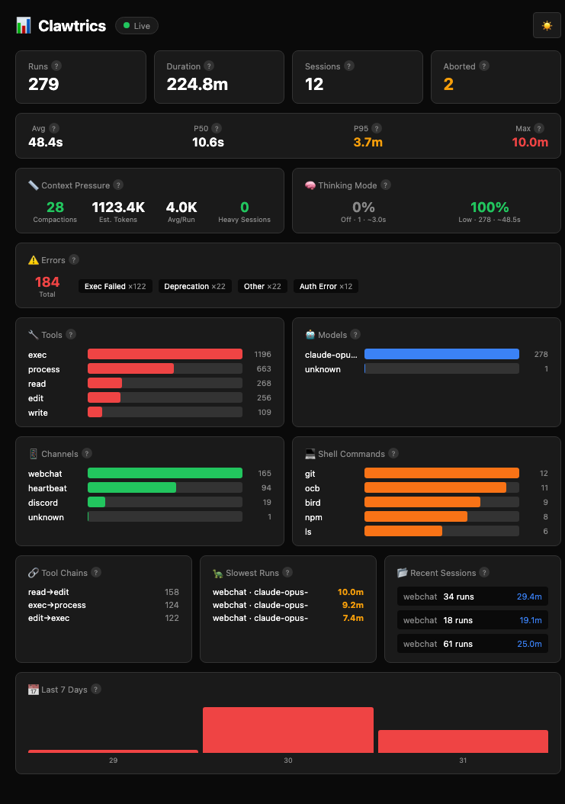

# 📊 Clawtrics

Metrics dashboard for OpenClaw — track run durations, tool usage, models, channels, and more.



## Features

- **Run metrics**: Total runs, duration, sessions, abort rate
- **Duration percentiles**: Average, P50, P95, Max
- **Context pressure**: Compaction tracking, estimated tokens
- **Thinking mode breakdown**: Distribution of reasoning levels (off/low/medium/high)
- **Error tracking**: Categorized error counts (exec failures, auth errors, etc.)
- **Cost estimation**: Per-run and projected monthly costs by model
- **Tool usage**: Bar chart of most-used tools
- **Model breakdown**: Which AI models you're using
- **Channel stats**: Discord, webchat, heartbeat, etc.
- **Session deep-dive**: Click any session to see full timeline
- **Real-time updates**: SSE-based live dashboard (no polling)
- **CLI companion**: Terminal-based metrics

## Quick Start

```bash
npx clawtrics-installer
```

This will:
- Check prerequisites (Node.js 18+, Git)
- Clone and build the dashboard
- Set up auto-start on boot (optional, macOS)

## Managing the Dashboard

```bash
npx clawtrics-installer status   # Check if running
npx clawtrics-installer start    # Start the dashboard
npx clawtrics-installer stop     # Stop the dashboard
npx clawtrics-installer restart  # Restart
npx clawtrics-installer logs     # View logs
npx clawtrics-installer open     # Open in browser
npx clawtrics-installer update   # Pull latest & rebuild
```

## Manual Installation

```bash
git clone https://github.com/finchinslc/clawtrics.git
cd clawtrics
npm install
npm run build
npm start

# Open http://localhost:3001
```

### Development Mode

```bash
npm run dev -- -p 3001
```

## CLI

```bash
npm run cli                 # Summary
npm run cli daily           # Daily breakdown
npm run cli tools           # Tool usage
npm run cli models          # Model usage
```

## Data Source

Clawtrics parses OpenClaw's log files from `/tmp/clawdbot/*.log` and `/tmp/openclaw/*.log`. These are NDJSON logs with structured run data.

### What's Tracked

- Run start/end times and duration
- Session IDs
- Model and provider
- Message channel (webchat, discord, etc.)
- Tool usage (exec, read, write, browser, etc.)
- Context pressure (compactions, token estimates)
- Thinking mode usage
- Errors by category
- Cost estimates (based on model pricing)

## Requirements

- Node.js 18+
- Git
- macOS or Linux

## License

MIT
